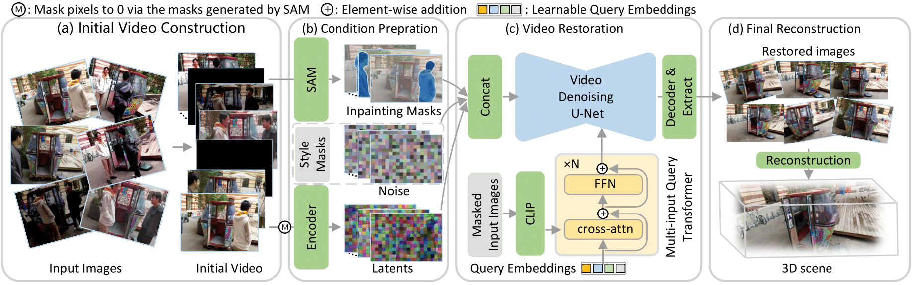
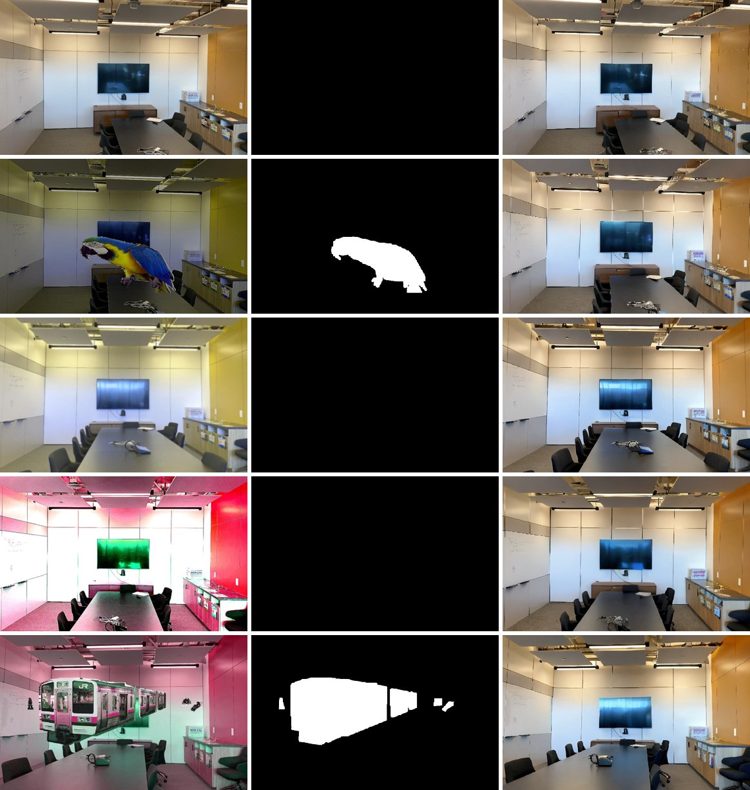

#  UniVerse: Unleashing the Scene Prior of Video Diffusion Models for Robust Radiance Field Reconstruction

This repository contains the code release for ICCV 2025 paper: "UniVerse: Unleashing the Scene Prior of Video Diffusion Models for Robust Radiance Field Reconstruction" by Jin Cao, Hongrui Wu, Ziyong Feng, Hujun Bao, Xiaowei Zhou, Sida Peng

**[Project Page](https://jin-cao-tma.github.io/UniVerse.github.io/) / [Arxiv](https://arxiv.org/abs/2510.01669)**





UniVerse reconstructs 3D scenes from **inconsistent** multi-view images (varying exposure, white
balance and post-processing, blur, noise, transient occluders). Instead of handling the
inconsistencies inside the 3D reconstruction, it first **restores** the images into consistent ones
with a video diffusion model, then reconstructs the scene from the restored images.


*The demo scene in `data/demo`: inconsistent inputs (left), inpainting masks of the transient objects
(middle), and the images restored by UniVerse (right; the style of all views follows the first one).*

## Contents

- [How it works](#how-it-works)
- [Installation](#installation)
- [Checkpoints](#checkpoints)
- [Quick start](#quick-start)
- [Restoring your own scene](#restoring-your-own-scene)
- [Generating inpainting masks](#generating-inpainting-masks)
- [Synthetic test scenes](#synthetic-test-scenes)
- [Training](#training)
- [Repository layout](#repository-layout)
- [Citation](#citation)

## How it works

Given K images with rough camera poses, `inference.py`

1. **sorts the images along an implicit camera trajectory** (*ThreadPose*): a doubly linked list is
   grown greedily from the first image (in file-name order), attaching at each step the image whose
   pose (rotation and translation distance) is closest to the head or the tail of the list;
2. **turns every batch of N images into a 25-frame initial video**: the images keep their order and
   the 25 - N missing frames are inserted as zero frames between neighbouring images, proportionally
   to their pose distance;
3. **restores the initial video** with a video diffusion model fine-tuned from
   [ViewCrafter](https://github.com/Drexubery/ViewCrafter) /
   [DynamiCrafter](https://github.com/Doubiiu/DynamiCrafter). The U-Net takes the noisy latents
   concatenated with the VAE latents of the initial video, an **inpainting mask** (1 = transient pixels
   and zero frames, to be generated) and a **style mask** (1 on the style image, whose appearance all
   other frames adopt). The CLIP embeddings of the N input images condition the model through a
   **Multi-input Query Transformer**;
4. **keeps the N restored frames** and continues with the next N - 1 images, using the last restored
   image as first frame and style image of the next batch, until all images are restored.

The batch size follows the paper: N = floor((K - 1) / O) + 1, with O the smallest integer such that
(K - 1) / O < 25 (a single batch when K <= 25).

## Installation

Tested with Python 3.9, PyTorch 1.13.1 and CUDA 11.7 on NVIDIA L40S GPUs.

```bash
git clone https://github.com/zju3dv/UniVerse.git
cd UniVerse
conda create -n universe python=3.9 -y
conda activate universe
pip install torch==1.13.1 torchvision==0.14.1 --extra-index-url https://download.pytorch.org/whl/cu117
pip install -r requirements.txt          # inference (includes xformers 0.0.16)
pip install -r requirements-train.txt    # optional: training
```

xformers provides memory-efficient attention; the memory figures below assume it.

## Checkpoints

| Model | Resolution | Training | Inference GPU memory | Checkpoint |
|---|---|---|---|---|
| UniVerse-512 | 320 x 512 | stage 1, 14,520 iterations | ~14 GB | [`universe_512.ckpt`](https://huggingface.co/TmaKiss/UniVerse/blob/main/universe_512.ckpt) |

The weights are hosted at [huggingface.co/TmaKiss/UniVerse](https://huggingface.co/TmaKiss/UniVerse).
`inference.py` downloads them into `checkpoints/` on first use; to download them beforehand:

```bash
hf download TmaKiss/UniVerse universe_512.ckpt --local-dir checkpoints
```

The checkpoint (10.4 GB) contains all the weights, including the VAE and the OpenCLIP ViT-H/14
encoders, so nothing else is downloaded. The 576 x 1024 model of the second training stage is not
released; `configs/inference_1024.yaml` (`--model 1024 --ckpt <checkpoint>`) runs a stage-2 model that
you train yourself (see [Training](#training)).

The model is fine-tuned from ViewCrafter's `ViewCrafter_25_sparse` (Apache-2.0), contain the
OpenCLIP ViT-H/14 weights trained on LAION-2B (MIT), and were trained on
[DL3DV-10K](https://github.com/DL3DV-10K/Dataset), which is released for non-commercial use
(CC BY-NC 4.0); please also respect the terms of these sources.

## Quick start

```bash
python inference.py --image_dir data/demo/images --out_dir output/demo
```

The first run downloads the checkpoint (10.4 GB). On one L40S, the demo (a single batch) then takes
about 1.5 min, including about 0.5-1 min to load the model.

## Restoring your own scene

### 1. Data layout

```
my_scene/
├── images/       # the inconsistent input images
├── masks/        # optional: inpainting masks (white = transient object), named like the images or <stem>.png
└── sparse/0/     # COLMAP model (images.txt or images.bin); alternatively my_scene/transforms.json
```

* **Poses** only need to be rough: they order the images and space them in the initial videos. Any
  COLMAP reconstruction works, e.g.
  ```bash
  colmap automatic_reconstructor --workspace_path my_scene --image_path my_scene/images --dense 0
  ```
  Images without a pose are skipped. Without poses (`--no_poses`), the images are taken in file-name
  order and spaced uniformly.
* **Masks** mark the transient objects (people, cars, ...) to remove; they can be generated with
  `scripts/generate_masks.py` (see below). Images without a mask are not inpainted.

### 2. Restore

```bash
python inference.py --image_dir my_scene/images --out_dir output/my_scene
```

Main options (`python inference.py -h` lists all of them):

| Option | Default | Description |
|---|---|---|
| `--model {512,1024}` | `512` | model preset (config, checkpoint and resolution); 1024 needs your own `--ckpt` |
| `--ckpt`, `--config` | from `--model` | checkpoint / config |
| `--mask_dir` | `<scene>/masks` if it exists | inpainting masks |
| `--colmap`, `--transforms`, `--no_poses` | `<scene>/sparse/0`, else `<scene>/transforms.json` | camera poses |
| `--style_image NAME`, `--style_index I` | first view in trajectory order | style image (see `order.txt`); it must be one of the views of the first batch (any view when K <= 25) |
| `--split S` | paper rule | new images per batch (N - 1), 1 <= S <= 24 |
| `--ddim_steps`, `--cfg_scale`, `--seed` | 50, 7.5, 3213 | sampling |
| `--no_video` | off | do not write the videos |
| `--device` | `cuda:0` | GPU |

### 3. Outputs

```
output/my_scene/
├── images/         # restored images, named like the inputs (JPEG inputs are saved at quality 95)
├── restored.mp4    # all restored images in trajectory order
├── order.txt       # batch, frame index and name of every image
├── args.json       # the options of the run
└── videos/         # iterXX_{input,inpaint_mask,style_mask,restored}.mp4 for every batch
```

The restored images have the model resolution (320 x 512): each input is resized to cover it and
center-cropped. To reconstruct the scene, run COLMAP again on the restored images, as in
the paper, and train any NeRF or 3D Gaussian Splatting model on them (the paper uses Zip-NeRF with
GLO).

### Reproducing the research notebook

`inference.py` is a cleaned-up version of the research notebook. By default it follows the paper in
three places where the notebook did not: all input images of the first batch (instead of a single one)
condition the Multi-input Query Transformer, the restored image carried over to the next batch gets an
empty inpainting mask, and the masks of every batch are built at the model resolution. On the
synthetic fern scene these defaults were slightly more accurate and more consistent across views.
`--notebook_compat` builds the model inputs exactly as the notebook did; for the notebook's run on the
authors' synthetic fern scene (not included; `scripts/synthesize_test_scene.py` builds similar scenes):

```bash
python inference.py --image_dir <fern>/images --split 14 --style_index 5 --notebook_compat \
    --out_dir output/fern_notebook
```

## Generating inpainting masks

`scripts/generate_masks.py` writes `<scene>/masks/<stem>.png` (single-channel, 255 = transient pixels
to inpaint), which `inference.py` picks up automatically.

```bash
# GroundingDINO + Segment Anything (default backend), as tested: the versions vendored in Grounded-SAM
git clone https://github.com/IDEA-Research/Grounded-Segment-Anything.git
cd Grounded-Segment-Anything && git checkout 126abe633ffe333e16e4a0a4e946bc1003caf757
pip install -e segment_anything
pip install --no-build-isolation -e GroundingDINO   # with CUDA_HOME set, to build the CUDA op
cd ..
wget -P checkpoints https://github.com/IDEA-Research/GroundingDINO/releases/download/v0.1.0-alpha/groundingdino_swint_ogc.pth
wget -P checkpoints https://dl.fbaipublicfiles.com/segment_anything/sam_vit_h_4b8939.pth

python scripts/generate_masks.py --images my_scene/images --prompts person car bicycle
```

The prompts must name the transient objects of the scene (e.g. `--prompts bird train` for the demo
scene). They are detected with GroundingDINO, segmented with SAM, merged, and dilated with a 5x5 kernel
(`--dilate`, in pixels of the input images; 5 matches the authors' masks of 1024x576 images);
detections smaller than 0.3% of the image are ignored (`--min_area`). `--save_vis` writes
overlays for checking. Masks that are named exactly like the images take precedence over `<stem>.png`. The paper's recipe, SegNeXt (ADE20K classes) followed by SAM, is available with
`--backend segnext_sam` after installing MMSegmentation and downloading the SegNeXt model
(`pip install -U openmim && mim install mmengine "mmcv>=2.0.0rc4,<2.2.0" && pip install mmsegmentation==1.2.2 ftfy regex`,
then `mim download mmsegmentation --config segnext_mscan-l_1xb16-adamw-160k_ade20k-512x512 --dest checkpoints`).
The default backend needs about 8 GB of GPU memory and 0.5 s per image.

## Synthetic test scenes

`scripts/synthesize_test_scene.py` turns a clean scene (e.g. an LLFF scene with its COLMAP model) into
an inconsistent test scene like the paper's synthetic benchmark: random brightness, contrast,
saturation, hue and sharpness, plus a pasted PASCAL VOC 2007 object, motion blur, Gaussian blur or
Gaussian noise per view. The LLFF hold-out views (every 8th) and the first view of the trajectory (the
style image) stay clean.

```bash
python scripts/synthesize_test_scene.py --scene_dir nerf_llff_data/fern --out_dir test_scenes/fern \
    --voc_root VOCdevkit/VOC2007
python inference.py --image_dir test_scenes/fern/images_train --out_dir output/fern
```

(`inference.py` then warns that the hold-out views listed in the poses are not in `images_train/`;
this is expected.) The output contains `images/` (all views), `images_train/` (the views to restore, i.e. without the
hold-out views), `gt/` (clean views), `masks/` (the pasted objects), the copied poses and
`degradation_log.json`.

## Training

UniVerse is fine-tuned in two stages from ViewCrafter's
[`ViewCrafter_25_sparse`](https://huggingface.co/Drexubery/ViewCrafter_25_sparse) model, whose 8-channel
U-Net input convolution is extended with two zero-initialised mask channels: stage 1 at 320 x 512
(14,520 iterations, learning rate 5e-5) and stage 2 at 576 x 1024 (12,000 iterations, learning rate
1e-5), with a global batch of 8. Training pairs are synthesised on the fly from 25-frame clips of
[DL3DV-10K](https://github.com/DL3DV-10K/Dataset): a random subset of frames is zeroed, the remaining
ones get random photometric changes plus blur, noise or an occluder, a random input frame is chosen as
style image, and the clean clip re-coloured like it is the target. The consistency loss weights the
input frames by lambda = 0.99 (`consistency_lambda`).

1. **Data.** Extract the clips (written to `data/train/clean_h/`) and put the occluder masks of
   [PASCAL VOC 2007](http://host.robots.ox.ac.uk/pascal/VOC/voc2007/) (`SegmentationClass`) at
   `data/occluders/VOC2007/SegmentationClass`:
   ```bash
   python scripts/prepare_dl3dv_clips.py --dl3dv_root /path/to/DL3DV-10K --out_dir data/train
   ```
   It writes 4 clips per scene (`--clips_per_scene`) at a random frame stride; re-running it only
   extracts new scenes, and `--num_shards`/`--shard_id` split the work across processes.
2. **Initial weights.** Stage 1 starts from `ViewCrafter_25_sparse`, stage 2 from UniVerse-512:
   ```bash
   hf download Drexubery/ViewCrafter_25_sparse model_sparse.ckpt --local-dir checkpoints
   hf download TmaKiss/UniVerse universe_512.ckpt --local-dir checkpoints
   ```
3. **Train** (single node; usage `bash scripts/train.sh <512|1024> [num_gpus: 1, 2, 4 or 8] [key=value ...]`,
   gradient accumulation keeps the global batch at 8):
   ```bash
   bash scripts/train.sh 512 8    # stage 1
   bash scripts/train.sh 1024 8   # stage 2
   ```
   Outputs go to `save_dir/universe_<stage>/`. Extra `key=value` arguments override the configs
   (`configs/train_512.yaml`, `configs/train_1024.yaml`), e.g.
   `model.pretrained_checkpoint=save_dir/universe_512/checkpoints/<ckpt>` to start stage 2 from your own
   stage 1. Checkpoints store the weights only, so a restart starts again from
   `model.pretrained_checkpoint` with a fresh optimizer.

   Memory: with the default `ddp` strategy, stage 1 uses about 42 GB per GPU (it barely fits on 48 GB
   GPUs) and stage 2 needs 80 GB GPUs. The paper's runs used 8 A100-80GB GPUs with optimizer sharding
   (`lightning.strategy=ddp_sharded` after `pip install fairscale`; not tested with this release).

The released weights were trained with an earlier version of the data pipeline (in particular, the
research runs also used two extra occluder pools from SegNeXt person/object masks), so retraining will
not reproduce them bit-exactly.

## Repository layout

```
inference.py                     # the complete restoration pipeline (single file)
configs/inference_{512,1024}.yaml, configs/train_{512,1024}.yaml
lvdm/                            # video diffusion model (from DynamiCrafter / ViewCrafter) + UniVerse
  models/ddpm3d.py               #   ConsistentVLDM: mask / style-mask conditioning, consistency loss
  modules/encoders/multi_resampler.py  #   Multi-input Query Transformer
  data/                          #   training data synthesis (degradations, online dataset)
main/                            # training entry point (PyTorch Lightning)
scripts/                         # masks, test scenes, DL3DV clips, training launcher
data/demo/                       # demo scene
checkpoints/                     # put the model weights here
licenses/                        # Apache-2.0 text and third-party notices
```

## Citation

```bibtex
@misc{cao2025universeunleashingsceneprior,
  title={UniVerse: Unleashing the Scene Prior of Video Diffusion Models for Robust Radiance Field Reconstruction},
  author={Jin Cao and Hongrui Wu and Ziyong Feng and Hujun Bao and Xiaowei Zhou and Sida Peng},
  year={2025},
  eprint={2510.01669},
  archivePrefix={arXiv},
  primaryClass={cs.CV},
  url={https://arxiv.org/abs/2510.01669},
}
```

## Acknowledgements

This code builds on [ViewCrafter](https://github.com/Drexubery/ViewCrafter) and
[DynamiCrafter](https://github.com/Doubiiu/DynamiCrafter), and through them on
[VideoCrafter](https://github.com/AILab-CVC/VideoCrafter),
[latent-diffusion](https://github.com/CompVis/latent-diffusion),
[improved-diffusion](https://github.com/openai/improved-diffusion) and
[ModelScope](https://github.com/modelscope/modelscope). The Multi-input Query Transformer extends the
resampler of [IP-Adapter](https://github.com/tencent-ailab/IP-Adapter),
[open_flamingo](https://github.com/mlfoundations/open_flamingo) and
[imagen-pytorch](https://github.com/lucidrains/imagen-pytorch), and the model uses
[OpenCLIP](https://github.com/mlfoundations/open_clip) encoders. Masks are generated with
[Grounded-SAM](https://github.com/IDEA-Research/Grounded-Segment-Anything)
([GroundingDINO](https://github.com/IDEA-Research/GroundingDINO),
[Segment Anything](https://github.com/facebookresearch/segment-anything)) or
[SegNeXt](https://github.com/Visual-Attention-Network/SegNeXt) via
[MMSegmentation](https://github.com/open-mmlab/mmsegmentation). Training uses
[DL3DV-10K](https://github.com/DL3DV-10K/Dataset) and [PASCAL VOC 2007](http://host.robots.ox.ac.uk/pascal/VOC/voc2007/);
camera poses come from [COLMAP](https://colmap.github.io/). The demo scene is derived from the LLFF
*room* scene released with [NeRF](https://github.com/bmild/nerf), with pasted PASCAL VOC objects.

## License

UniVerse is released under the [Project Registration License (PRL) v1.0](LICENSE). Code adapted from
other projects remains under its original license: the model code in `lvdm/`, the training code in
`main/` and the model loading / sampling functions in `inference.py` come from ViewCrafter and
DynamiCrafter ([Apache License 2.0](licenses/LICENSE-Apache-2.0.txt); modified files carry a notice at
the top), and further components are listed in
[licenses/THIRD_PARTY_NOTICES.md](licenses/THIRD_PARTY_NOTICES.md). The demo scene (`data/demo`) is
third-party data and is not covered by the repository license, nor is `assets/demo.jpg`, which shows it
(see `data/demo/README.md`).
