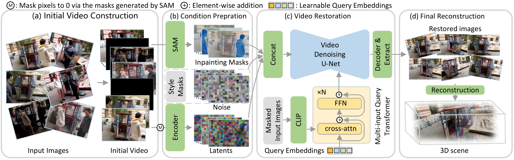

#  UniVerse: Unleashing the Scene Prior of Video Diffusion Models for Robust Radiance Field Reconstruction

This repository contains the code release for SIGGRAPH (TOG) 2024 paper: "Bilateral Guided Radiance Field Processing" by Yuehao Wang, Chaoyi Wang, Bingchen Gong, and Tianfan Xue.

**[Project Page](https://bilarfpro.github.io/) / [Arxiv](https://arxiv.org/abs/2406.00448) / [Data](https://huggingface.co/datasets/Yuehao/bilarf_data)**

**Code is currently being organized and will be released soon** 🚧 